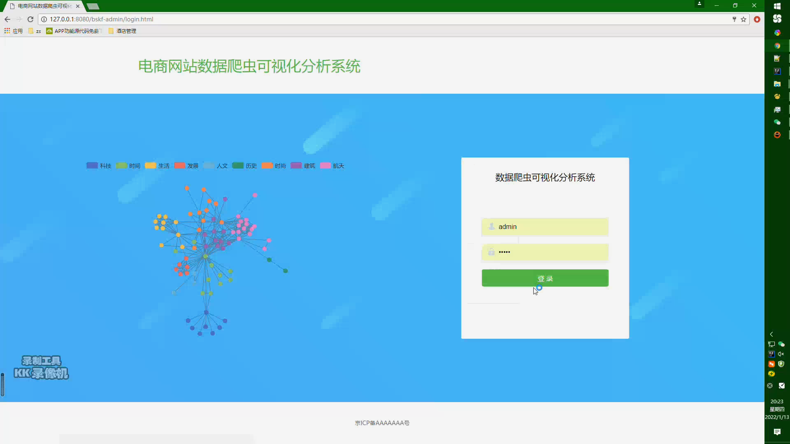

## 计算机毕业设计之SpringBoot+Vue.js+WebMagic电商数据分析 电商大数据 电商知识图谱 电商数据采集系统 电商大屏 大数据毕业设计

## 要求
源码一套有偿(论文 开题报告  文献综述  源码+sql脚本)
加好友前帮忙start一下，并备注github有偿获取源码
我的QQ号是2877135669或者1679232425
加qq好友说明（被部分 网友整得心力交瘁）：
    1.加好友务必按照格式备注
    2.避免浪费各自的时间！
    3.当“客服”不容易，repo 主是体面人，不爆粗，性格好，文明人。

https://www.bilibili.com/video/BV1j44y1L7Qu?spm_id_from=333.999.0.0

# 【功能模块】

近5年电商企业社会责任数据，数据可视化

（1） 社会责任数据

（2） 电商企业：（30家左右的数据即可）

1-10名：阿里巴巴、美团点评、拼多多、京东、小米集团、滴滴、贝壳找房、京东健康、阿里健康、携程。

11-20名：网易、唯品会、安克创新、叮咚买菜、苏宁易购、达达、逸仙电商、同程艺龙、微盟集团、国联股份。

21-30名：前程无忧、跟谁学、阿里影业、南极电商、万物新生、中国有赞、国美零售、三只松鼠、网易有道、良品铺子。

31-40名：宝尊电商、乐信、掌门教育、每日优鲜、丽人丽妆、猫眼娱乐、联络互动、上海钢联、壹网壹创、小熊电器。

41-50名：优信、御家汇、什么值得买、新东方在线、光云科技、新氧、焦点科技、冠福股份、药易购、卓尔智联。

（3） 数据库：MySQL

（4） 可视化数据：

1、 电商企业所在地分布图

2、得分、员工责任、股东责任、等级

3、 年份

4、 电商企业排名

5、 参考视频演示添加部分动画效果，比如鼠标停留在哪个电商企业就显示它的数据

# 【创新点】

1.知识图谱

2.大屏统计。

3.爬虫。

# 【运行截图】

![kk 2022-01-13 20-23-[00_00_39][20220114-211846]](kk 2022-01-13 20-23-[00_00_39][20220114-211846].png)

![kk 2022-01-13 20-23-[00_00_52][20220114-211903]](kk 2022-01-13 20-23-[00_00_52][20220114-211903].png)

![kk 2022-01-13 20-23-[00_00_57][20220114-211912]](kk 2022-01-13 20-23-[00_00_57][20220114-211912].png)

![kk 2022-01-13 20-23-[00_00_59][20220114-211920]](kk 2022-01-13 20-23-[00_00_59][20220114-211920].png)

![kk 2022-01-13 20-23-[00_01_13][20220114-211937]](kk 2022-01-13 20-23-[00_01_13][20220114-211937].png)

![kk 2022-01-13 20-23-[00_01_21][20220114-211948]](kk 2022-01-13 20-23-[00_01_21][20220114-211948].png)

![kk 2022-01-13 20-23-[00_01_42][20220114-212011]](kk 2022-01-13 20-23-[00_01_42][20220114-212011].png)

# 运行视频B站
https://www.bilibili.com/video/BV1j44y1L7Qu?spm_id_from=333.999.0.0

